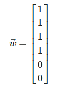

Análisis de sentimientos de tweets. Vamos a crear un máquina que pueda decirnos qué tan positivo, neutral o negativo son una serie de respuestas de twitter. Las respuestas son:

-Excelente en su área, su muerte es una enorme pérdida y debería ser luto nacional!!!

-Vaya señora que bueno que se asesora por alguien inteligente.

-Se me ocurre y sin ir a clase me informéis por dónde empiezo. Entiendo que os tendría que decir quién soy y que quiero, vamos conocerme para asesorarme bien. Un saludo

-Soy docente universitario, estoy intentando preparar mis clases en modo bien didáctico, (le llamo modo noticiero), descargue una plataforma gratuita de grabación y transmisión de vídeo, se llama Obs estudio!bueno la sigo remando con sus funciones pero sé que saldrá algo!

Ahora bien, no podemos sacar toda la información de los textos sino vamos a buscar cadenas (strings) específicas. Así pues vamos a construir una función de Python que cuente la cantidad de veces que aparece cierta cadena. Como ejemplo, supongamos que las palabras que vamos a contar son muerte, pérdida, luto, excelente,gran y positivo, y además esto lo queremos expresar como vector en orden respectivo, así pues el primer comentario lo podemos expresar como el siguiente vector:

Ahora, vamos a crear otra función en la que tendremos el vector con entradas de cantidad de palabras positivas, neutras y negativas. Siguiendo con el ejemplo vamos a sumar un uno a la primer entrada si aparece alguna de las siguientes palabras excelente,gran y positivo, un uno en la segunda por cada vez que aparezca la palabra pérdida y un uno a la última entrada si aparecen las palabras muerte y luto. Así pues, el primer twett lo podemos representar como:

Ahora, para ver la calidad del resultado que tendremos para un twett conviene calcular el promedio de las entradas de un vector de palabras

siendo n la longitud del vector w

Y después calcularás el promedio del sentimiento de cada tweet avg(s⃗ ) y de igual manera el score sentimental que se define como
score

Leyendo los tuits decide el conjunto mínimo de palabras que vas a contar en todos los tuits, solamente deberás hacer una función para contar palabras para todos los tuits, no hagas un función por enunciado. Según tu esquema reponde lo siguiente:

-¿Qué tuit es más positivo?

-¿Qué tuit es más negativo?

-¿Cuál es tu calidad promedio?

-¿Cómo interpretas avg(s) y score(s)?

-¿Cómo relacionas la calidad con score(s) y avg(s)?

